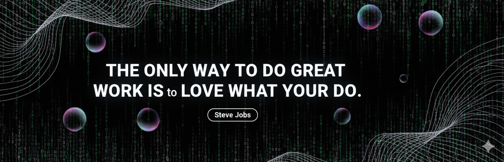

<!-- HEADER -->

  

  

<h3 align="center">
  Xin chào •
  
  • Hello •
  
</h3>

  🌏 HCMC • 💼 Seeking Frontend Internship

<!-- Badge wall -->

  

  

  

<h3 align="center">Software Engineering Student at PTIT | Full-Stack Developer | Data & AI Enthusiast</h3>

<h2>👾 About me</h2>

I'm Nguyen Minh Khanh, a third-year student majoring in Information Technology (IT) at the Posts and Telecommunications Institute of Technology (PTIT). I'm passionate about exploring how to build effective software systems and am currently focused on strengthening my foundational knowledge in Object-Oriented Programming (OOP), Data Structures & Algorithms, and Web Application Development.

<ul>
  <li>🔭 <b>Currently</b>: Completing core coursework and actively seeking Front-end or Back-end internship opportunities for the upcoming year.</li>
  <li>🌱 <b>Learning</b>: Deep diving into <i>ReactJS, Python/Django, Java Spring Boot</i> and exploring Cloud Computing technologies (AWS/Azure/GCP).</li>
  <li>🛠️ <b>Interests</b>: Full-stack Web Development, Artificial Intelligence (AI), and IoT integration.</li>
  <li>📫 <b>Connect</b>: 
    <a href="mailto:n23dccn165@student.ptithcm.edu.vn">n23dccn165@student.ptithcm.edu.vn</a>
  </li>
</ul>

<!-- 🔗 Connect & Social -->
<h3>🔗 Connect & Social</h3>

<!-- Nút social: GitHub, LinkedIn, TikTok, Facebook, Instagram, Mail -->

  <!-- GitHub -->
  
  <!-- LinkedIn -->
  
  <!-- TikTok -->
  
  <!-- Facebook -->
  
  <!-- Instagram -->
  
  <!-- Mail -->
  
    <!-- Discord -->
  

---

### 🚀 Featured Projects
- 🎬 **[D-Cine — Cinema Management System](https://github.com/minhkhanh-ptiter/DCineProject)**  
  A Java + MySQL app for cinema operations, ticketing, and revenue reports.  
  *Tech:* Java, MySQL, Swing, JDBC, MVC pattern.

- 🎓 **[Student Management System](https://github.com/minhkhanh-ptiter/StudentManager)**  
  C++ console app with search, sort, accent-insensitive comparisons using ICU.  
  *Tech:* C++, ICU, Linked List, CSV I/O.

- 🌐 **[Portfolio Web (in progress)](https://github.com/minhkhanh-ptiter/Portfolio)**  
  Personal portfolio site to showcase projects and achievements.  
  *Tech:* HTML, CSS, JS, React.

---

### 🧰 Languages, Frameworks & Tools

  

---

### 🏆 Achievements & Awards
- 🥇 **Top Project Presentation – PTIT (2024)**  
- 🎖️ **Database Design Contest – Finalist**  
- 🧩 **AI Hackathon Participant – PTIT Innovation Lab 2025**  
- 💬 **Volunteer Mentor – Intro to Programming Workshops**

---

### 📊 GitHub Stats

  
  

  

---

### 🏅 GitHub Trophies

  

---

### 🗓️ Contribution Graph

  

---

### 💬 Random Dev Quote

  

---

### 🤝 How to Collaborate
- 🧩 Open to teamwork on Java, C++, and web projects.  
- 📫 Contact via [email](mailto:minhkhanh@example.com) for collaborations or student events.  
- ⭐ Feel free to **star** my repositories if you find them useful!  

---

 
   
  <i>Made with ❤️ •  Minh Khanh</b></i> ☕

